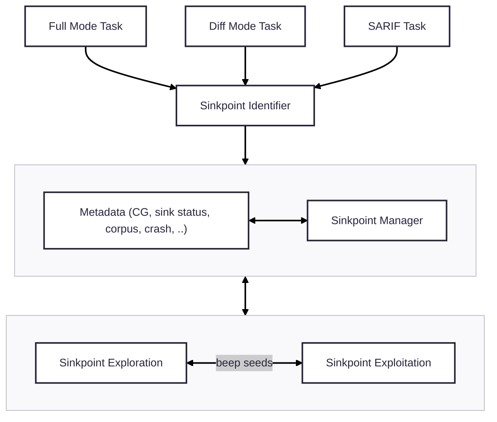

# Atlantis-Java

Atlantis-Java is a sinkpoint-centered Java vulnerability detection framework (aka Cyber Reasoning System, or CRS). It is built based on the understanding that Java CPV finding is mostly a sinkpoint exploitation task. Specifically, it can be divided into two subtasks, reaching the sinkpoint and exploiting the sinkpoint. Each subtask has its own challenges.

At the first place, it launches ensemble fuzzing with several kinds of fuzzers we built to find CPVs inside the target CP (Challenge Project), then leverages LLM, static analysis, and runtime information to conduct sinkpoint-centered analysis to boost the CPV finding by generating input blobs to fuzzers.

## Overall Architecture



In Atlantis-Java, we have techniques facilitating both sinkpoint exploration and exploitation. Some code locations are identified as sinkpoints and those sinkpoint reaching seeds (we call it beep seed) will be lifted to a specific exploitation phase for further PoC construction. Additionally, all components in Atlantis-Java are aware of the runtime status of sinkpoints, which helps them to avoid duplicate efforts on reached/exploited sinkpoints, prioritize diff-task/sarif-task related sinkpoints, etc.

Sinkpoint exploration techniques:

- directed Jazzer
- libafl-based Jazzer
- llm-poc-gen, a Joern-based, path-based, LLM-based, input generator
- concolic executor
- deepgen, initial corpus generation agent
- dictgen, dictionary generator
- fuzzing ensembler

Sinkpoint exploitation techniques:

- expkit, an LLM-based beep seed exploitation agent
- llm-poc-gen, a Joern-based, path-based, LLM-based, input generator
- concolic executor

## Publication

Key components of Atlantis-Java have been rigorously evaluated in a peer-reviewed paper, published at IEEE S&P '26. The paper focuses on three components:

- **Sink detection**: CodeQL-based sink identification with multi-stage filtering (including LLM-based exploitability assessment)
- **Sinkpoint exploration** (`llm-poc-gen`): LLM-based call-path-guided input generation to reach sinks
- **Sinkpoint exploitation** (`expkit`): LLM-based beep seed exploitation agent

The evaluation covers 54 vulnerabilities across 22 open-source Java projects and 12 CWE types. See the paper for the full methodology and results:

> Fabian Fleischer, Cen Zhang, Joonun Jang, Jeongin Cho, Meng Xu, Taesoo Kim. *Contextualizing Sink Knowledge for Java Vulnerability Discovery.* In IEEE S&P '26. [[pre-print]](https://arxiv.org/abs/2604.01645)

<details>
<summary>BibTeX</summary>

```bibtex
@inproceedings{fleischer:sink-fuzzing,
  title        = {{Contextualizing Sink Knowledge for Java Vulnerability Discovery [To Appear]}},
  author       = {Fabian Fleischer and Cen Zhang and Joonun Jang and Jeongin Cho and Meng Xu and Taesoo Kim},
  booktitle    = {Proceedings of the 47th IEEE Symposium on Security and Privacy (Oakland)},
  month        = may,
  year         = 2026,
  address      = {San Francisco, CA},
}
```

</details>

## Source code

The implementation lives in [./crs](./crs), please refer to [./crs/README.md](./crs/README.md) for more details.

## Running with oss-crs

We recommend running Atlantis-Java through OSS-CRS.

Prerequisites:

- [oss-crs](https://github.com/occia/oss-crs) installed (`uv run oss-crs`)
- An OSS-Fuzz project directory (e.g. `oss-fuzz/projects/aixcc/jvm/atlanta-activemq-delta-01`)
- The target source code (e.g. `cp-java-activemq-source`)
- LiteLLM API endpoint and key (set via `EXTERNAL_LITELLM_API_BASE` and `EXTERNAL_LITELLM_API_KEY`)

#### Compose Configuration

See `oss-crs/example/atlantis-java-sinkfuzz/compose.yaml` for a working example.
The compose file points to this CRS and configures resource limits and LLM settings.

#### Steps

```bash
# 1. Build the CRS runner image
uv run oss-crs prepare \
  --compose-file ./example/atlantis-java-sinkfuzz/compose.yaml

# 2. Build the target (compiles fuzzers + creates CodeQL database)
uv run oss-crs build-target \
  --compose-file ./example/atlantis-java-sinkfuzz/compose.yaml \
  --fuzz-proj-path <path-to-oss-fuzz-project> \
  --target-source-path <path-to-target-source>

# 3. Run the CRS
uv run oss-crs run \
  --compose-file ./example/atlantis-java-sinkfuzz/compose.yaml \
  --fuzz-proj-path <path-to-oss-fuzz-project> \
  --target-source-path <path-to-target-source> \
  --target-harness <harness-name> \
  --timeout 1800
```

## Local development

For more details of building, running, and developing Atlantis-java locally, see [README.dev.md](./README.dev.md).

## Integration to k8s competition env

It will be built and invoked by the entire CRS system, interfaces include:

- Docker image preparation scripts
  - `docker-build.sh`
  - `docker-img-push.sh`
- Entry script
  - `crs/run-crs-java.sh`
- Specific env var
  - `TARBALL_DIR`
  - `JAVACRS_TARBALL_DIR`
  - ..

## LICENSE

GPL V2, see [LICENSE](./LICENSE)
